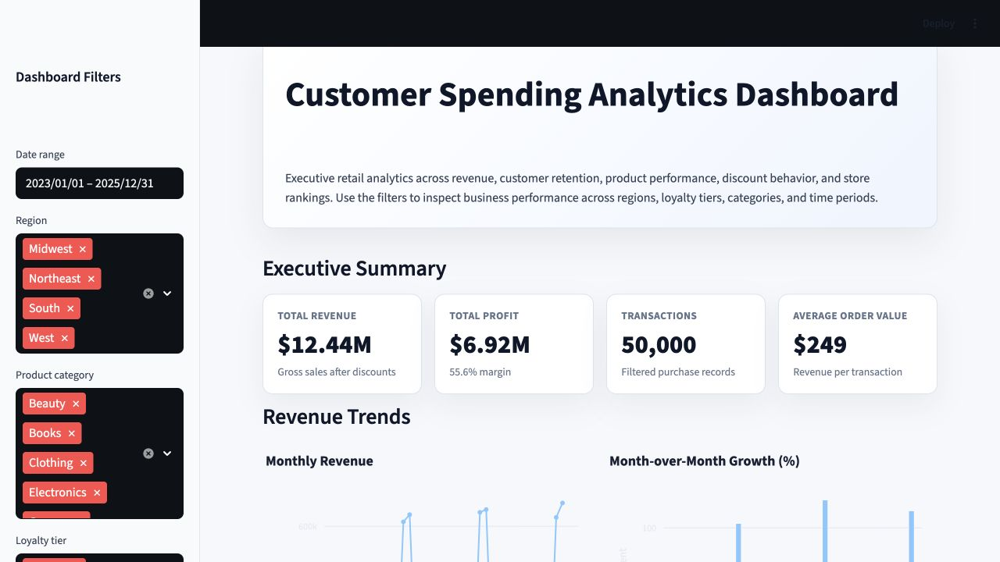
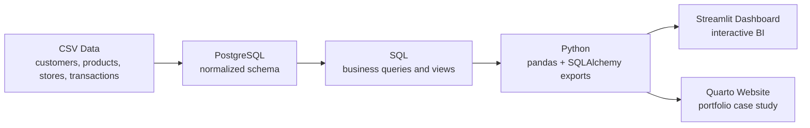
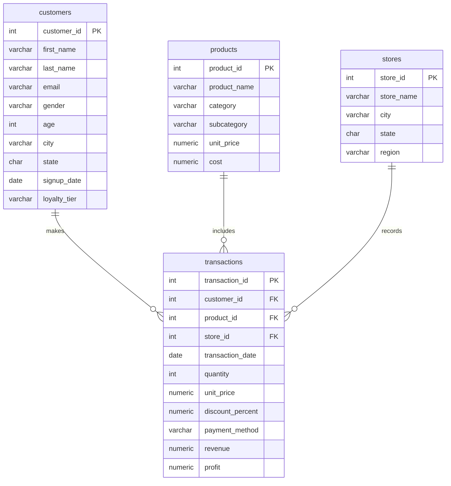

# Customer Spending Analytics Dashboard


A polished retail analytics portfolio project that analyzes 50,000+ transactions to uncover revenue trends, customer behavior, product performance, discount impact, churn risk, and store-level opportunities.

## Project Links

- **GitHub Repository:** https://github.com/vmadagiri/customer-spending-analytics-dashboard
- **Portfolio Website (Quarto):** Coming soon
- **Live Streamlit Dashboard:** Coming soon

## Executive Summary

This project simulates a realistic business analytics workflow for a retail company. It generates synthetic operational data, loads it into a normalized PostgreSQL database, answers stakeholder questions with SQL, exports analysis-ready datasets with Python, and presents insights through both an interactive Streamlit dashboard and a recruiter-friendly Quarto portfolio case study.

## Dashboard Preview



## Business Problem

Retail leaders need to understand which customers, products, stores, seasons, and promotions drive profitable growth. This analysis converts transaction-level data into business recommendations for customer retention, merchandising, regional planning, and discount strategy.

## Tech Stack

- SQL and PostgreSQL for schema design, joins, aggregations, CTEs, views, and window functions
- Python, pandas, SQLAlchemy, and Faker for data generation, loading, automation, and exports
- Plotly and matplotlib for visualization
- Streamlit for the interactive business intelligence dashboard
- Quarto for the polished portfolio case study website
- Jupyter Notebook for exploratory analysis

## Dataset Overview

The project generates four normalized CSV files in `data/raw`:

| File | Rows | Description |
| --- | ---: | --- |
| `customers.csv` | 5,000 | Demographics, location, signup date, and loyalty tier |
| `products.csv` | 300 | Product catalog with category, subcategory, price, and cost |
| `stores.csv` | 50 | Store metadata with city, state, and region |
| `transactions.csv` | 50,000+ | Purchases with quantity, discount, payment method, revenue, and profit |

The synthetic data includes repeat customers, weighted best-selling products, holiday seasonality, and discount-driven quantity effects.

## Architecture



## Database Schema



## SQL Analysis

The project includes 26 business queries in `sql/04_business_queries.sql`, covering:

- Executive KPI summary
- Monthly revenue and profit trends
- Month-over-month growth
- Top customers and customer lifetime value
- Repeat customer rate
- RFM customer segmentation
- Churn-risk customers
- Cohort retention
- Product, category, margin, and discount analysis
- Weekday/weekend and seasonal trends
- Regional and store performance rankings
- 3-month moving averages and cumulative revenue

Techniques demonstrated include `INNER JOIN`, `LEFT JOIN`, `GROUP BY`, `HAVING`, CTEs, multiple CTEs, `ROW_NUMBER`, `RANK`, `LAG`, `SUM OVER`, moving averages, `CASE` statements, date functions, and customer segmentation.

## Streamlit Dashboard

The dashboard in `dashboard/app.py` includes:

- Executive KPI cards for revenue, profit, transactions, and average order value
- Date range, region, product category, and loyalty tier filters
- Monthly revenue and month-over-month growth charts
- Top customers, RFM segments, and churn-risk customers
- Top products, category revenue, and category margin
- Regional revenue and store rankings
- Business recommendations based on the selected data

Run it with:

```bash
streamlit run dashboard/app.py
```

## Quarto Portfolio Website

The repo also includes a Quarto website in `website/` that presents this project as a professional case study. It includes the business problem, dataset description, database schema, SQL analysis, dashboard overview, insights, recommendations, resume bullets, and screenshot gallery.

Render it with:

```bash
cd website
quarto preview
```

## How to Run Locally

```bash
cd "customer-spending-analytics-dashboard"
python -m venv .venv
source .venv/bin/activate
pip install -r requirements.txt
```

Create a PostgreSQL database:

```bash
createdb customer_spending
```

If your PostgreSQL credentials are not `postgres/postgres`, copy `.env.example` to `.env` and edit the values:

```bash
cp .env.example .env
```

Generate data, load PostgreSQL, export query results, and run the dashboard:

```bash
python src/generate_data.py --transactions 50000
python -m src.load_to_postgres
python -m src.run_queries
streamlit run dashboard/app.py
```

You can also run the dashboard immediately after generating CSVs:

```bash
python src/generate_data.py --transactions 50000
streamlit run dashboard/app.py
```

## Folder Structure

```text
customer-spending-analytics-dashboard/
├── README.md
├── requirements.txt
├── config.py
├── data/
│   ├── raw/
│   └── processed/
├── sql/
│   ├── 01_create_tables.sql
│   ├── 02_load_data.sql
│   ├── 03_data_cleaning.sql
│   ├── 04_business_queries.sql
│   └── 05_views.sql
├── src/
│   ├── generate_data.py
│   ├── load_to_postgres.py
│   ├── run_queries.py
│   └── utils.py
├── dashboard/
│   └── app.py
├── website/
│   ├── _quarto.yml
│   ├── index.qmd
│   ├── analysis.qmd
│   ├── dashboard.qmd
│   └── insights.qmd
├── notebooks/
│   └── customer_spending_analysis.ipynb
├── images/
└── dashboard_screenshots/
```

## Screenshots To Add

Save Streamlit screenshots in `dashboard_screenshots/` using these filenames:

- `executive_summary.png`
- `revenue_trends.png`
- `customer_analytics.png`
- `product_store_analytics.png`

These screenshots are referenced by the Quarto website.

## Key Insights

- Holiday-heavy periods create visible revenue and transaction lift.
- Discounting can increase units sold, but margin impact should be monitored by category and product.
- Repeat customers and high-RFM segments are important retention targets.
- Product category performance varies across regions, supporting localized merchandising.
- High-value customers with long purchase gaps should be prioritized for win-back campaigns.

## Resume Bullets

- Analyzed 50,000+ retail transactions by developing 20+ SQL queries using joins, CTEs, window functions, and aggregations to uncover customer behavior, revenue trends, and business insights.
- Automated a PostgreSQL analytics pipeline with Python, pandas, SQLAlchemy, and Faker to generate synthetic retail data, create normalized tables, load CSV files, and export reusable query results.
- Built an interactive Streamlit business intelligence dashboard and Quarto portfolio case study with KPI cards, Plotly visualizations, filters, business recommendations, and recruiter-ready documentation.

## Future Improvements

- Add Docker Compose for one-command PostgreSQL setup.
- Add dbt models and tests for production-style analytics engineering.
- Schedule refreshes with Airflow or GitHub Actions.
- Add churn prediction or customer propensity modeling.
- Deploy the dashboard to Streamlit Community Cloud and the Quarto site to GitHub Pages.

---

# My Development Journey

## Why I Built This

As I prepare for graduate studies in Data Science and pursue data analytics internships, I wanted to build a project that demonstrates an end-to-end analytics workflow similar to what I would encounter in industry.

Instead of analyzing a small pre-cleaned dataset, I wanted to simulate a realistic retail business environment by generating over 50,000 transactions, storing them in PostgreSQL, writing advanced SQL to answer business questions, and presenting those insights through an interactive dashboard.

The primary goal wasn't just to build visualizations—it was to practice thinking like a data analyst by transforming raw transactional data into actionable business recommendations.

---

## What I Learned

Building this project gave me practical experience with the workflow of a data analyst from generating structured data to designing a relational database, writing SQL for business questions, and presenting insights through interactive dashboards.

- Designing a normalized relational database in PostgreSQL
- Writing advanced SQL using joins, CTEs, aggregations, and window functions
- Building reusable Python scripts for ETL workflows
- Connecting Python with PostgreSQL using SQLAlchemy
- Developing interactive dashboards using Streamlit
- Presenting technical work as a business-focused case study using Quarto
- Structuring a project that is reproducible and easy for others to understand

---

## Challenges

Some of the most interesting challenges during this project included:

- Designing synthetic retail data that behaved realistically enough to support meaningful business analysis.
- Creating SQL queries that answered real business questions rather than simply demonstrating SQL syntax.
- Organizing the project so each component (database, SQL, Python, dashboard, and documentation) worked together as one complete analytics workflow.
- Making the dashboard intuitive for someone with no technical background while still exposing detailed analytical insights.

---

## What I'd Improve Next

This project is intended to continue evolving. Future improvements include:

- Deploying the Streamlit dashboard for public access
- Publishing the Quarto website with GitHub Pages
- Connecting the dashboard to a live PostgreSQL database instead of generated CSV files
- Adding automated data refresh workflows
- Expanding the analysis with predictive models for customer churn and sales forecasting
- Writing unit tests for the Python ETL pipeline

---

## Reflection

This project represents my transition from completing guided coursework to building independent, portfolio-quality analytics projects.

Beyond learning individual tools, it helped me understand how SQL, Python, PostgreSQL, visualization, and storytelling work together to support data-driven business decisions. Going forward, I plan to continue expanding this project while applying the same workflow to additional business and machine learning case studies.
