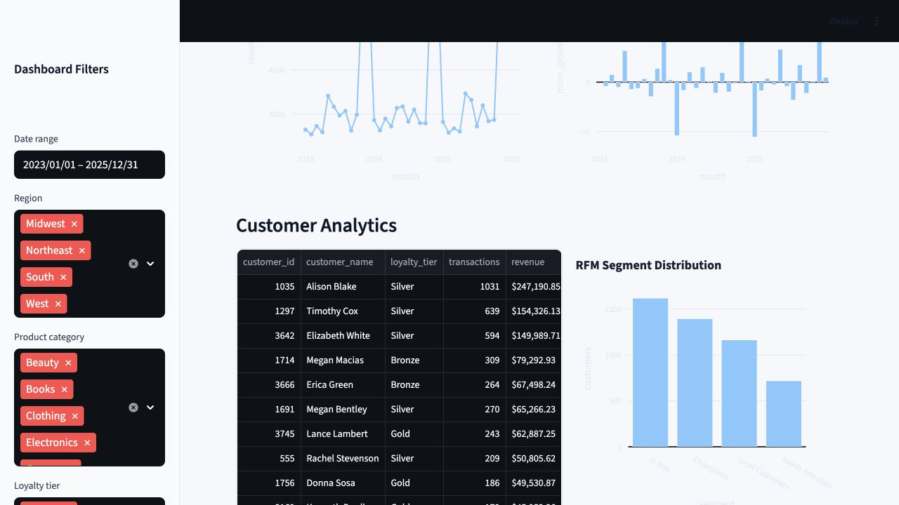
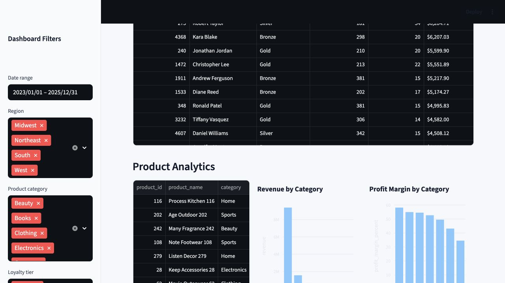
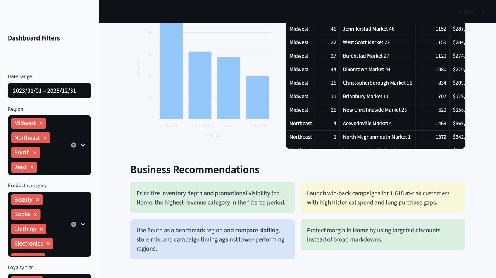

## Streamlit Dashboard

The Streamlit dashboard is designed as an executive-facing business intelligence tool. It includes KPI cards, filters, charts, customer tables, product analysis, store rankings, and business recommendations.

::: {.button-row}
[Open Streamlit Dashboard](https://your-streamlit-app-url){.button .primary}
[View Source Code](https://github.com/your-username/customer-spending-analytics-dashboard/blob/main/dashboard/app.py){.button .secondary}
:::

## Dashboard Sections

::: {.card-grid .three}
::: {.card}
### Executive Summary
Total revenue, total profit, transaction count, and average order value.
:::

::: {.card}
### Revenue Trends
Monthly revenue and month-over-month growth charts.
:::

::: {.card}
### Customer Analytics
Top customers, RFM segment distribution, and churn-risk customers.
:::

::: {.card}
### Product Analytics
Top products, revenue by category, and profit margin by category.
:::

::: {.card}
### Store Analytics
Revenue by region and store performance rankings.
:::

::: {.card}
### Recommendations
Filtered, business-facing actions based on the current dashboard view.
:::
:::

## Screenshots

Add screenshots to `dashboard_screenshots/` after running the Streamlit app. The recommended filenames below are already referenced by this website.

::: {.screenshot-grid}
::: {.screenshot-card}

Executive Summary with filters, KPI cards, and current business performance.
:::

::: {.screenshot-card}

Monthly revenue and month-over-month growth.
:::

::: {.screenshot-card}

Top customers, RFM segmentation, and churn-risk table.
:::

::: {.screenshot-card}

Category performance, margin analysis, regional revenue, and store rankings.
:::
:::

## UX Design Notes

The dashboard is organized for a business user who needs quick answers: high-level KPIs first, then trend context, then customer, product, and store drilldowns. Filters are kept in the sidebar so the main page remains focused on analysis.
